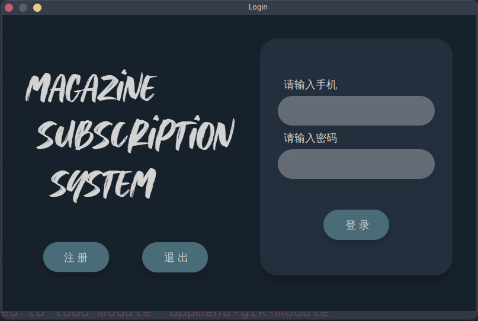
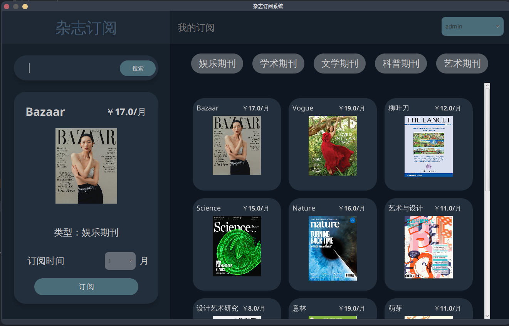
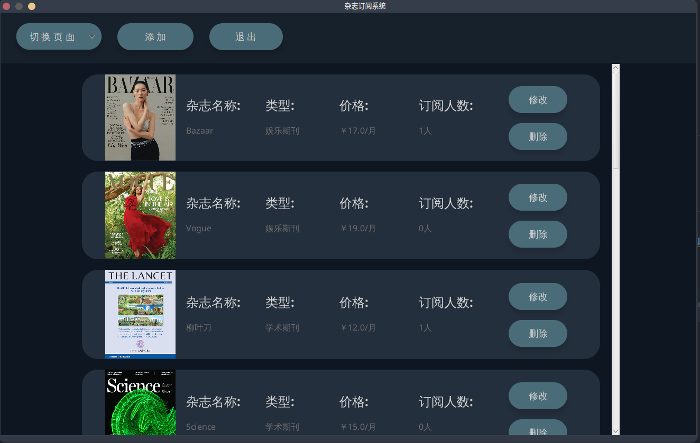

# `MagSubSys`

## 介绍
杂志订阅系统的目的是为了学习`Javafx`和提高编程思维而实现的。 该系统将用户分为两种类型：一种为普通用户，另一种为管理员用户

- 作为普通用户，通过创建新账户，使用杂志订阅系统，并管理自己的订阅信息。
- 作为管理员用户，通过杂志后台管理系统，可以对杂志，用户以及订单进行管理。

具体的内容请查看详细代码

## 软件架构

`MagezineSys`是主要的项目（项目名称打太急打错了），`MagazineImg`是程序运行时候所需要的图片。

## 安装教程

找到指定目录，执行以下代码即可

````
git clone https://gitee.com/Eccentric0521/mag-sub-sys.git
````

## 快速开始

1. 配置`mysql`环境：执行`resources`下的三个`sql`文件
2. 修改`jdbc`配置文件：将`resources`下的`jdbc.properties`文件的内容修改成自己的数据库和账号密码
3. 修改文件地址`(FileHelp)`的配置文件：将`resources`下的`FileHelp.properties`文件的内容更改为项目`MagazineImg`的地址（注意：后边要有`'/'`）
4. 运行代码：运行`src/main/java/com/eccentric/Starter/Main.java`文件
5. 登陆账户：可以普通用户（账号：`admin`，密码：`123123`）的界面，还可以通过管理员账户登陆（账号：`root`，密码：`root`）

## 运行效果

登陆/注册页面



普通用户页面



管理员页面



## 开发环境

操作系统：`Arch Linux`

开发环境：`IDEA`

`JDK`版本：`jdk1.8`

数据库版本：`MySQL 10.9.4`

`Maven`版本：`Apache Maven 3.8.6`

## 疑问答疑

若存在问题可以联系`QQ`：202765405

## 版权问题

该系统根据学习自`https://github.com/mahmoudhamwi/Fruits-Market`，如侵权请联系作者删除
